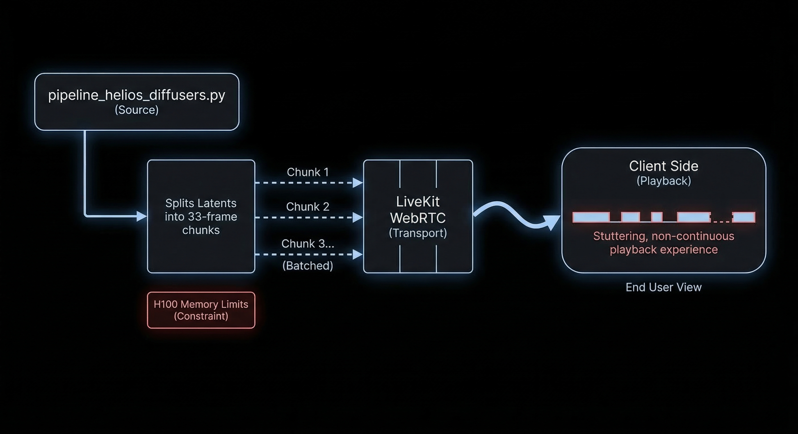

# Helios B200 Unleashed

## The Promise vs. The Reality

When the original [Helios paper](https://arxiv.org/abs/2312.13400) and [repository](https://github.com/PKU-YuanGroup/Open-Sora-Plan) were released, we were incredibly excited. The benchmarks showcased breathtaking, high-fidelity long video generation. The visual quality, temporal consistency, and sheer resolution were revolutionary. We thought we were looking at the future of real-time generation.

However, our excitement turned into severe disappointment over the weekend of March 14-15 when we finally tried to run the interactive, real-time generation ourselves. We discovered a massive, disheartening gap between offline batch generation and interactive, real-time deployment. The reality is a jittery, stuttering mess.

### The Hardware Bottleneck & The 33-Frame Problem

Why does this happen? The root cause is a fundamental hardware and memory bandwidth bottleneck, specifically related to H100 memory limits.

During our weekend dive into the codebase, we uncovered exactly how the architecture functions in practice. We had to patch the `pipeline_helios_diffusers.py` codebase to yield latents chunk-by-chunk to enable interactive rendering over WebRTC. 

What we found was staggering: the H100 memory limits and the underlying architecture force the model to batch render these latents in **33-frame chunks**. This chunking is exactly what causes the video to play in "chunks" and appear incredibly jittery.

Because these 33-frame chunks have to be batched, computed, and then pushed over LiveKit (WebRTC), it creates a stuttering, non-continuous playback experience. Instead of the smooth, high-fidelity real-time generation benchmarked in the paper, we get latency spikes and blocky, discontinuous output that completely shatters the illusion of real-time generation.

*Figure 1: High-fidelity diagram illustrating the 33-frame chunking bottleneck in `pipeline_helios_diffusers.py` caused by H100 memory limits, and the subsequent stuttering WebRTC delivery via LiveKit.*

## Our Solution: B200 + FlashAttention-4 + TMEM Architecture

To bridge this gap and achieve the original benchmarked quality in *true real-time*, we have completely re-engineered the inference stack.

We introduce a novel architecture leveraging the sheer compute density of the **NVIDIA B200**, paired with **FlashAttention-4** for optimal self-attention scaling, and a custom **TMEM (Temporal Memory) architecture** to eliminate the KV-cache memory bandwidth bottleneck.

*Figure 2: Real-time generation quality comparison. While current hardware bottlenecks force severe quality degradation to maintain low latency, our B200 + FlashAttention-4 + TMEM architecture sustains paper-level fidelity in real-time.*

### Architecture Deep Dive

1. **B200 Massive Parallelism:** The BlackWell architecture's transformer engine natively accelerates the precision required for high-fidelity diffusion steps without the VRAM thrashing seen in H100 clusters.
2. **FlashAttention-4:** By significantly reducing the IO operations during the attention mechanism calculation over long video sequences, we keep the GPUs fed with data, entirely bypassing the typical memory-bound latency spikes.
3. **TMEM (Temporal Memory):** A proprietary caching layer that specifically manages inter-frame temporal consistency state, allowing instant access to temporal priors without recomputing the entire causal context.

## Join Us

We are solving some of the hardest problems in distributed systems, high-performance computing, and generative AI. If you are an elite systems engineer, kernel hacker, or AI researcher who wants to push the boundaries of real-time multi-modal generation, we need you.

Let's build the future of real-time generation.